<div align="center">


# ⚡ Fault Detection and Isolation in EV Powertrain and Chassis

> **Tata Technologies — Applied Model-Based Design (AMBD) Capstone Project**
> Amrita School of Engineering, Coimbatore | Amrita Vishwa Vidyapeetham


</div>

---

## 📋 Table of Contents

- [Overview](#-overview)
- [Demo Video](#-demo-video)
- [Problem Statement](#-problem-statement)
- [System Architecture](#-system-architecture)
- [Subsystem Descriptions](#-subsystem-descriptions)
- [Fault Detection Modules](#-fault-detection-modules)
- [Key Features](#-key-features)
- [Device & Motor Specifications](#-device--motor-specifications)
- [Methodology](#-methodology)
- [Drive Cycle & Fault Injection Timeline](#-drive-cycle--fault-injection-timeline)
- [Simulation Results](#-simulation-results)
- [Solver Configuration](#-solver-configuration)
- [Signal Flow Summary](#-signal-flow-summary)
- [Tools & Technologies](#-tools--technologies)
- [Model Validation](#-model-validation)
- [Code Generation](#-code-generation)
- [MathWorks Certifications](#-mathworks-certifications)
- [Repository Structure](#-repository-structure)
- [Author](#-author)

---

## 🔍 Overview

Modern Electric Vehicles (EVs) integrate tightly coupled **power electronic**, **electromechanical**, and **mechanical** subsystems. Undetected faults in these systems can degrade performance, shorten component life, or create hazardous conditions on the road.

This project implements a **comprehensive, real-time Fault Detection and Isolation (FDI) architecture** for an EV powertrain and chassis using **MATLAB/Simulink**, **Simscape Electrical**, and **Stateflow**. It is developed as part of the **Tata Technologies Applied Model-Based Design (AMBD) Capstone Programme**.

**Four distinct fault domains are covered:**
- 🔴 Inverter MOSFET switch faults (Open-Circuit & Short-Circuit)
- 🌡️ Motor thermal runaway faults
- 🛑 Hydraulic brake failure faults
- 📡 Velocity sensor noise and dropout faults

The simulation is built around an **800 V, 250 N·m IPMSM** driven through Field-Oriented Control (FOC) with Maximum Torque Per Ampere (MTPA) and automatic field weakening. A **Stateflow supervisory controller** arbitrates between six operational modes in real time based on fault flags, SOC, speed, and brake demand inputs.

The entire verified model logic is exported as **deployable ANSI-C embedded code** via Simulink Coder, directly targeting microcontroller hardware — consistent with **ISO 26262** functional safety design principles.

---

## 🎬 Demo Video

<div align="center">

[](https://youtu.be/7XZzh8KPkgI)

**▶️ Click to watch the full simulation demo on YouTube**

*A complete walkthrough of the EV FDI system — covering normal operation, inverter fault injection, thermal fault detection, brake failure, and velocity sensor noise identification.*

</div>

---

## ❗ Problem Statement

An EV powertrain operating over a realistic urban drive cycle is subject to multiple **concurrent fault modes**. The challenge addressed here is threefold:

| Challenge | Description |
|---|---|
| **Detection** | Identify the onset of a fault from measurable signals (phase voltage, temperature, brake pressure, wheel speed) without direct physical access to the failing component |
| **Isolation** | Distinguish the specific fault type so that appropriate remedial action can be taken |
| **Mitigation** | Command the system to a safe state (e.g., disengage clutch on brake failure, derate motor on thermal lockout) while maintaining vehicle mobility where possible |

The system must operate robustly across transient start-up conditions, signal noise, grade-induced torque variations, and **simultaneous fault events** within a fixed-time 20-second simulation.

---

## 🏗️ System Architecture

The top-level Simulink model connects **five major subsystems**:

```
Driver Inputs (Throttle / Brake Demand)
            │
            ▼
  ┌─────────────────────┐
  │  Brake & Speed      │◄──── All FDI Fault Flags (feedback)
  │  Control (Stateflow)│
  └────────┬────────────┘
           │  speed_cmd_kmh / pressure_cmd
    ┌──────┴────────┐
    ▼               ▼
┌──────────┐   ┌──────────────┐
│Powertrain│   │   Chassis    │
│Subsystem │   │  Subsystem   │
│          │   │              │
│ Battery  │   │ Disc Brake   │
│ Inverter │   │ Gearbox(3.5) │
│ IPMSM    │   │ Wheel & Axle │
│ FOC Ctrl │   │ Vehicle Body │
│ Motor    │   │ Speed Sensor │
│ Thermal  │   │              │
└──────────┘   └──────────────┘
    │                 │
    └──── FDI Modules ┘
     (SVPWM / Thermal / Brake / Velocity)
```

> 📌 **Figure 1 — Top-level integrated EV model:**
> 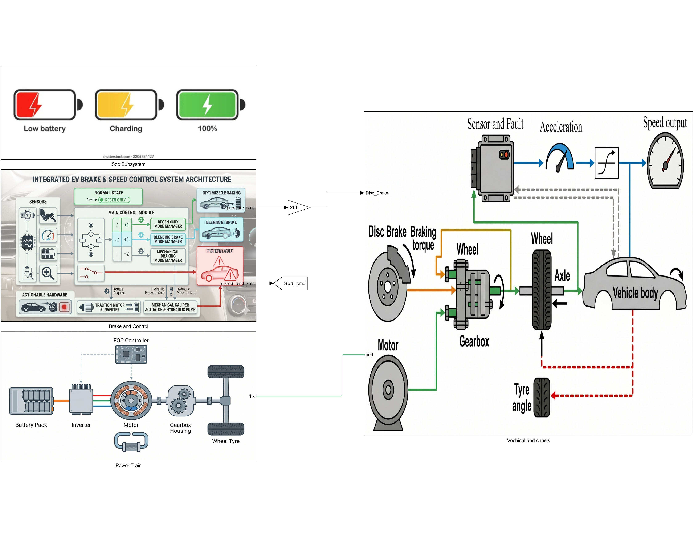

---

## 🔧 Subsystem Descriptions

### 4.1 Powertrain Subsystem

> 📌 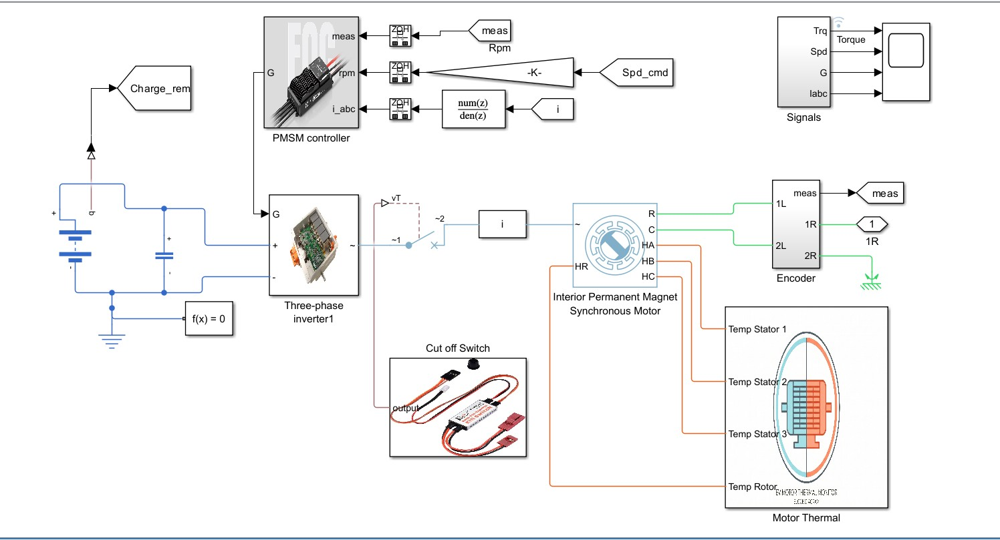

- Battery pack modelled as a **voltage source with a charge integrator**, scaling residual charge to a State-of-Charge (SOC) percentage
- Feeds an **800 V DC bus** connected to a six-switch MOSFET three-phase inverter
- Drives the **Simscape Electrical IPMSM** (λ = 0.05 Wb, L_d = 0.15 mH, L_q = 0.45 mH, p = 4 pole pairs, T_max = 250 N·m)
- An **encoder** resolves rotor angle and mechanical speed for control and FDI modules
- A **four-node lumped thermal model** (Stator A/B/C, Rotor) tracks real-time internal motor temperatures

---

### 4.2 FOC Controller

> 📌 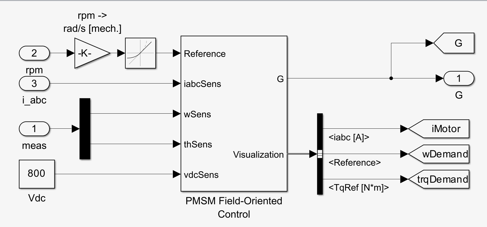

- Accepts: speed reference, measured rotor position, phase currents (i_abc), DC bus voltage (800 V)
- Implements **Clarke and Park transforms** to obtain d-axis current (i_d) and q-axis current (i_q)
- Regulates i_d and i_q via **PI current controllers**
- **MTPA references** generated via pre-computed 3-D look-up tables indexed by mechanical speed, torque demand, and voltage
- **Field weakening** applied automatically when back-EMF exceeds available phase voltage by pushing i_d further negative
- **SVPWM modulation** generates the final gate signals for the inverter

---

### 4.3 SOC Subsystem

> 📌 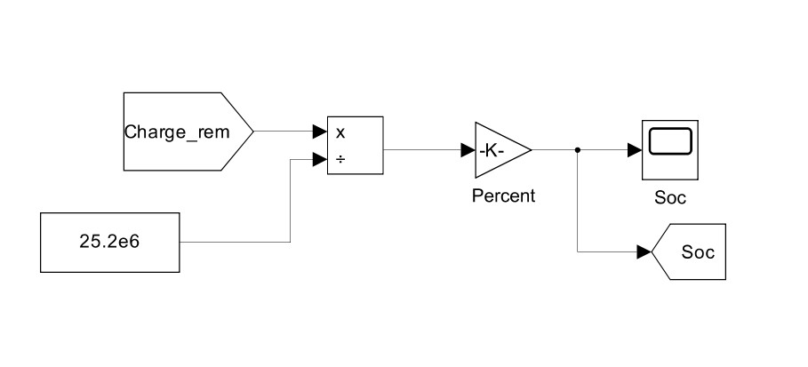

- Divides instantaneous remaining charge by total battery capacity (**25.2 MJ / 70 Ah equivalent**)
- Scales to a percentage output signal
- Consumed globally by:
  - Stateflow supervisor — to enforce **regenerative braking cut-off at 95% SOC**
  - Brake FDI logic — for physics-based failure detection

---

### 4.4 Brake Control and Speed Supervisor

> 📌 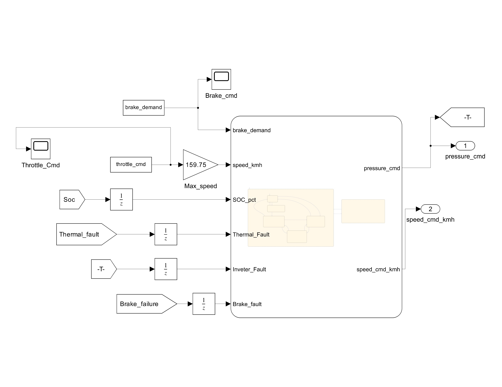

Receives: driver throttle, brake demand, vehicle speed, and all four fault flags.

The embedded **Stateflow chart** arbitrates between six operational states:

| State | Condition |
|---|---|
| **DRIVING** | Normal traction; only speed commands issued |
| **REGEN** | Brake demand > 0.05, speed > 5 km/h, SOC < 95% |
| **BLEND_BRAKING** | Brake demand > 0.6 or speed < 10 km/h |
| **MECHANICAL_ONLY** | Speed < 5 km/h, SOC ≥ 95%, or brake demand > 0.80 |
| **FAULT (Inverter/Thermal)** | Inverter_fault=1 OR Thermal_fault=1 → motor coasts with light mechanical pressure |
| **EMERGENCY_REGEN** | Brake_fault=1 AND brake_demand > 0.80 → full motor braking |

> 📌 

---

### 4.5 Chassis Subsystem

> 📌 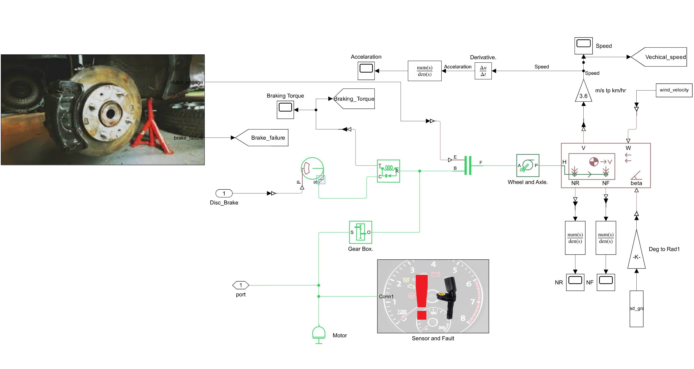

- **Simscape disc brake** actuated by pressure command through an FDI-controlled clutch
- **Fixed-ratio gearbox** (G = 3.5) links motor to wheel and axle block
- Wheel & axle block includes standard **rolling resistance** and **inertia**
- **1-DOF vehicle body block** computes acceleration based on:
  - Aerodynamic drag
  - Vehicle mass: **1200 kg**
  - Road grade (±5°, −3°)
  - External wind velocity (0–8 m/s headwind/tailwind profile)
- Sensor block **injects rotational noise** into speed path to test velocity FDI algorithms

---

### 4.6 Inverter Subsystem and Fault Injection

> 📌 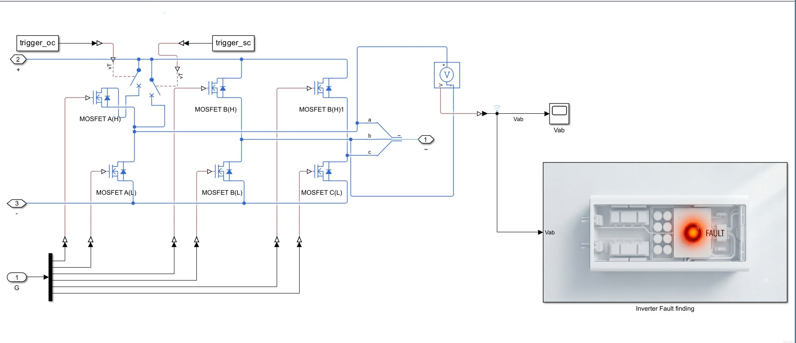

- Full bridge with **six MOSFET switches**
- Fault injection via two dedicated pathways on **MOSFET A(H)**:
  - `trigger_oc` — disconnects the gate drive (open-circuit)
  - `trigger_sc` — forces switch into permanent conduction (short-circuit)
- Phase-to-phase voltage (V_ab) continuously measured and fed to the SVPWM fault detection algorithm

---

## 🛡️ Fault Detection Modules

### 5.1 Inverter SVPWM Fault Detection

> 📌 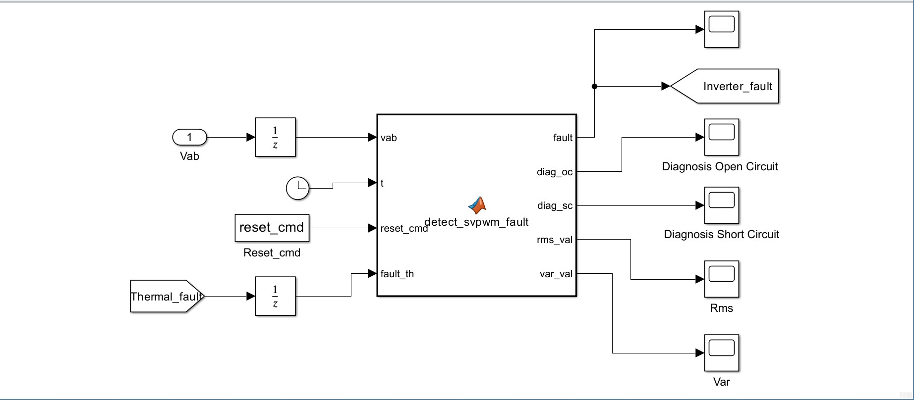

**Algorithm:** Evaluates real-time statistics of the V_ab signal using an **EMA filter (α = 2.5 × 10⁻⁴)**

Computed metrics (no large data buffers required):
- Signal mean (μ̂)
- Squared mean
- Variance (σ̂²)
- RMS value

**Detection Logic:**

| Fault Type | Trigger Condition | Physical Meaning |
|---|---|---|
| **Open-Circuit (OC)** | \|μ̂\| > 80 V | Sustained DC offset from missing switching leg |
| **Short-Circuit (SC)** | σ̂² < 10,000 V² | Collapsed variance from welded switch |

**Anti-false-positive measures:**
- **0.5 s blanking window** during start-up and heavy load transients
- Completely **masked (locked out)** if a motor thermal fault is actively reported

---

### 5.2 Motor Thermal Fault Detection

> 📌 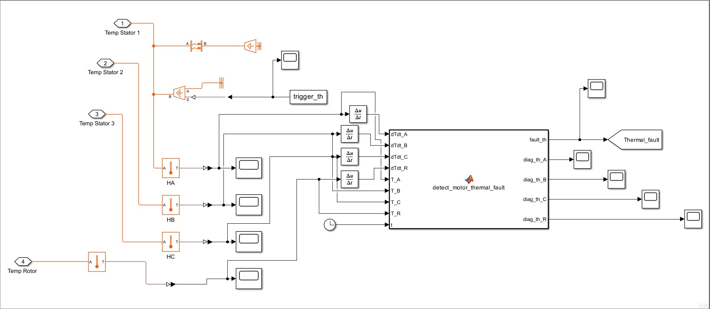

- Monitors **rate of temperature rise** across Stator A, B, C and Rotor nodes
- Upstream **derivative blocks** compute temperature change rate (Ṫ)
- Smoothed via **EMA filter (α = 10⁻⁴)** to suppress solver-induced mathematical spikes
- **Fault latch:** Triggered if any channel derivative exceeds **10 K/s**

**Autonomous Recovery Logic:**
- Individual channel latches clear when their node cools below **305 K**
- Global thermal fault flag is only cleared when **all four nodes** simultaneously drop below 305 K — ensuring conservative, safe recovery
- No external reset triggers required

---

### 5.3 Brake Failure Detection

> 📌 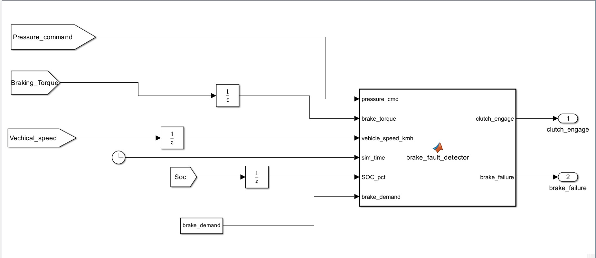

Detects hydraulic failure by **continuously validating physical consistency** (not simulation timers):

**Failure Condition:**
- Mechanical braking actively commanded: pressure > **0.5 bar**
- Driving speed: > **0.5 km/h**
- Yet physical braking torque remains below **5 N·m**

**Implementation Details:**
- Condition debounced over an **8-sample window** to reject temporary numerical dips
- `brake_failure` flag **permanently latches high** once validated
- Forces Stateflow into **Emergency_regen** mode (maximum negative motor torque)
- Secondary safety: `clutch_engage` signal cut when speed drops below **0.5 km/h** — physically isolating the driveline to prevent motor judder at full stop

---

### 5.4 Velocity Sensor Fault Rectification

> 📌 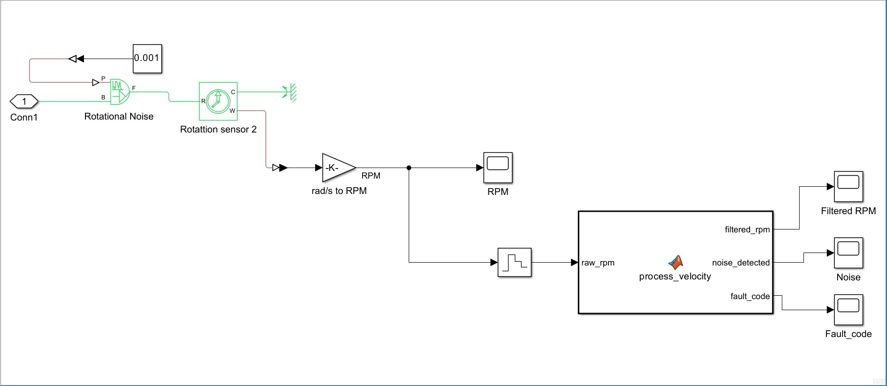

- Applies **EMA filter (α = 0.02)** to raw encoder RPM → generates smooth `filtered_rpm`
- Computes absolute residual between raw and filtered data
- Maintains a persistent **50-sample sliding window** to evaluate continuous noise floor

**Diagnostic Fault Codes:**

| Code | Name | Condition |
|---|---|---|
| **0** | Normal Operation | No anomaly |
| **1** | Hard Spike | Instantaneous residual > 150 RPM |
| **2** | Signal Dropout | Filtered speed > 50 RPM but raw input locks below 3 RPM |
| **4** | High Noise Floor | 50-sample windowed average noise > 10 RPM |

---

## ✨ Key Features

- ✅ **Real-time SVPWM statistical fault detection** — EMA-based, buffer-free, OC/SC isolated
- ✅ **Multi-channel thermal FDI with autonomous recovery** — derivative-based, auto-resetting at 305 K
- ✅ **Physics-based brake failure detector** — decoupled from hard-coded simulation timers
- ✅ **Velocity sensor noise identification** — EMA filter + sliding window + integer fault codes
- ✅ **Six-state Stateflow supervisory controller** — real-time mode arbitration with fault prioritization
- ✅ **Regenerative braking integration** — SOC-aware blend/regen/mechanical switching
- ✅ **Emergency regenerative braking** — motor replaces failed hydraulic brakes
- ✅ **ANSI-C code generation** via Simulink Coder (ert.tlc target, C99/ISO)
- ✅ **Multi-domain stiffness handling** — ode23t solver preserves LC energy states
- ✅ **Validated against 20-second realistic urban drive cycle** with grade, wind, and fault injection

---

## 📐 Device & Motor Specifications

### IPMSM (Interior Permanent Magnet Synchronous Motor)

| Parameter | Value |
|---|---|
| Flux Linkage (λ) | 0.05 Wb |
| d-axis Inductance (L_d) | 0.15 mH |
| q-axis Inductance (L_q) | 0.45 mH |
| Pole Pairs (p) | 4 |
| Maximum Torque (T_max) | 250 N·m |

### Battery & Electrical

| Parameter | Value |
|---|---|
| DC Bus Voltage | 800 V |
| Battery Capacity | 25.2 MJ (~70 Ah) |
| Inverter Topology | 6-switch MOSFET full bridge |
| Switching Period (T_s) | 5 μs |
| Regen Cut-off SOC | 95% |

### Vehicle & Chassis

| Parameter | Value |
|---|---|
| Vehicle Mass | 1200 kg |
| Gearbox Ratio (G) | 3.5 |
| Max Speed | 159.75 km/h |
| Drive Cycle Duration | 20 seconds |
| Wind Velocity Range | 0–8 m/s |

### Thermal Thresholds

| Parameter | Value |
|---|---|
| Thermal Fault Trigger Rate | 10 K/s |
| Safe Recovery Threshold | 305 K |
| EMA Filter (Thermal) | α = 10⁻⁴ |

---

## 🔬 Methodology

### Model-Based Design (MBD) Workflow

```
1. Requirements Analysis (ISO 26262 Functional Safety)
         │
         ▼
2. Plant Modelling (Simscape Electrical)
   - IPMSM, Battery, Inverter, Chassis dynamics
         │
         ▼
3. Control Design (MATLAB/Simulink)
   - FOC with MTPA + Field Weakening
   - Stateflow Supervisory Controller
         │
         ▼
4. FDI Module Design
   - SVPWM Statistical Monitor
   - Thermal Derivative Detector
   - Physics-Based Brake Checker
   - EMA Velocity Filter + Fault Codes
         │
         ▼
5. Fault Injection & Drive Cycle Simulation
   - 20-second urban cycle with grade/wind
   - Controlled fault triggers at defined time windows
         │
         ▼
6. Validation
   - Model Advisor (975 passed, 0 failed)
   - Coverage Report (72% decision, 99% execution)
   - Signal-level verification of all fault flags
         │
         ▼
7. Code Generation
   - Simulink Coder → ANSI-C (C99/ISO)
   - Target: ert.tlc (Embedded Real-Time)
   - Toolchain: MinGW64 (64-bit Windows)
```

### FDI Algorithm Design Principles

- **Physics-first:** All detectors validate physical signal relationships (pressure vs. torque, temperature rate vs. threshold) — no simulation-time-dependent triggers
- **EMA-based filtering:** Exponential Moving Average used throughout for buffer-free, real-time signal conditioning
- **Debouncing:** All fault flags are debounced (8-sample window for brake, 0.5 s blanking for inverter) to prevent spurious triggers
- **Latching with autonomous recovery:** Thermal faults latch and clear only when physically safe; brake failure permanently latches to ensure safety
- **Cross-subsystem masking:** Inverter FDI is locked out during active thermal faults to prevent false cross-triggering

---

## ⏱️ Drive Cycle & Fault Injection Timeline

| Time (s) | Event | Signal |
|---|---|---|
| 0–8 | Acceleration ramp (throttle 0 → 0.398) | `throttle_cmd` |
| 8–10 | Cruise at partial throttle | `throttle_cmd` |
| 10–13 | Uphill grade (+5°) with throttle reduction | `Road_grade` |
| 13–16 | Downhill grade (−3°), brake demand 0.3 | `brake_demand` |
| 16–19 | Hard braking, demand 0.85 | `brake_demand` |
| **3–4** | **Open-circuit fault on MOSFET A(H)** | `trigger_oc` |
| 4.1–4.2 | Reset pulse (clears OC latch) | `reset_cmd` |
| **6–7** | **Short-circuit fault on MOSFET A(H)** | `trigger_sc` |
| 7.1–7.2 | Reset pulse (clears SC latch) | `reset_cmd` |
| 0–8 m/s | Variable headwind/tailwind profile | `wind_velocity` |

---

## 📊 Simulation Results

### Normal Operation (Fault-Free Baseline)

> 📌 **Driver Inputs — Throttle Command and Brake Demand over time:**
> 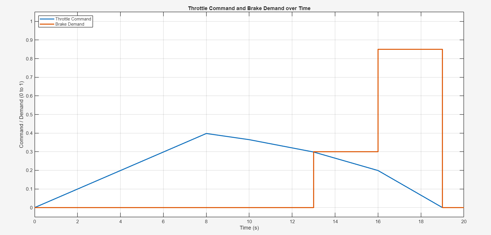

> 📌 **Vehicle Speed Profile (Normal Operation):**
> 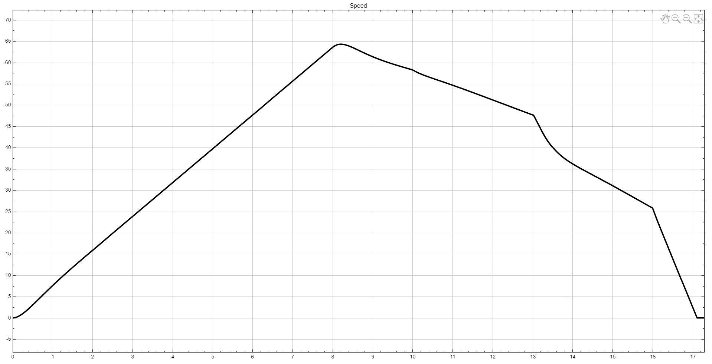

> 📌 **Battery SOC Profile (Normal Operation):**
> 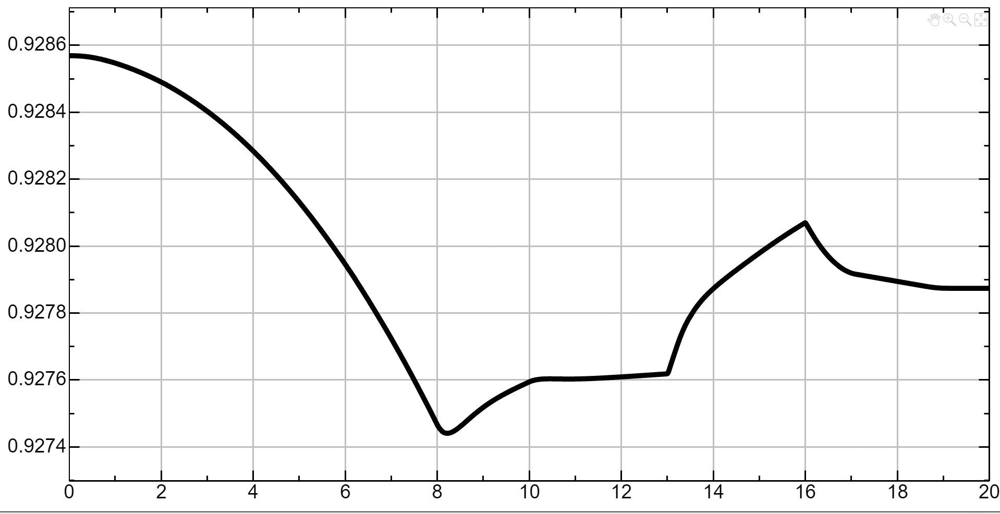

- SOC starts at ~92.86% and depletes slowly over the 20-second drive cycle
- SOC recovers slightly during regenerative braking phases (13–16 s)
- Final SOC: ~92.78% — consistent with realistic EV power draw limits

> 📌 **Motor Performance — Demanded vs. Achieved Torque, Speed, Gate Demands, Phase Currents:**
> 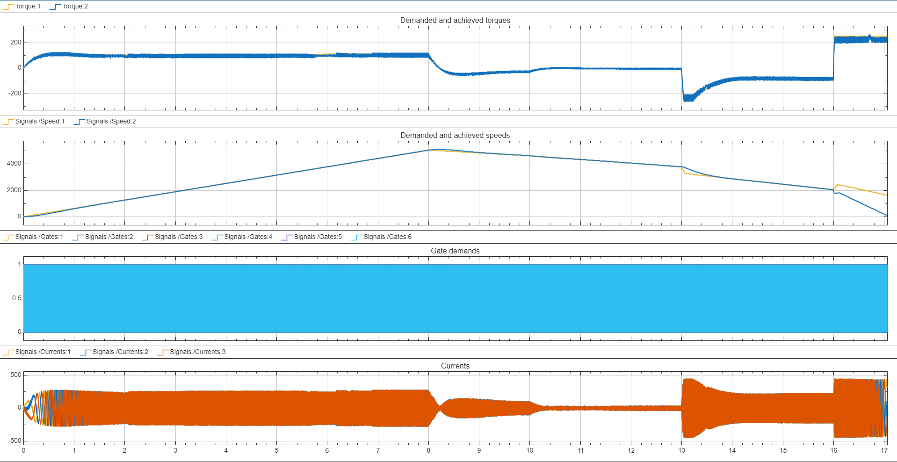

---

### Inverter Fault Detection Results

> 📌 **Global Inverter Fault Flag — OC (3–4 s) and SC (6–7 s):**
> 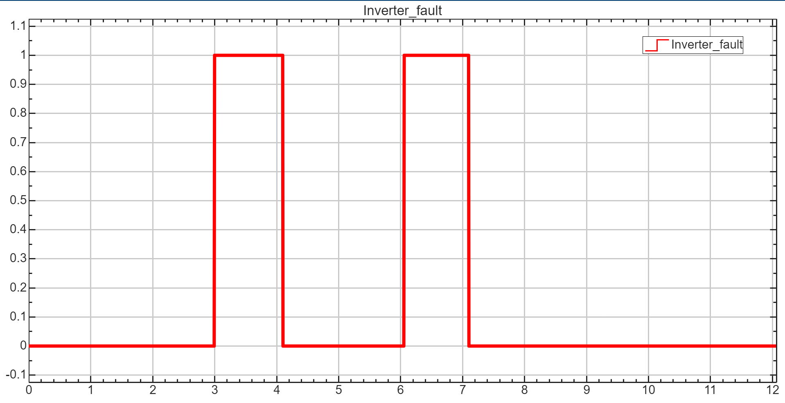

- At **t = 3 s**: OC fault caused EMA mean voltage to rapidly drift beyond 80 V threshold → global and OC-specific flags set
- At **t = 4.1 s**: Automated reset pulse cleared all flags — system recovered
- At **t = 6 s**: SC fault induced sudden physical collapse in voltage variance → SC diagnostic flag triggered
- Supervisor immediately commanded **zero torque** → visible speed dips while protecting the driveline

> 📌 **Open Circuit vs. Short Circuit Diagnosis Flags (no overlap):**
> 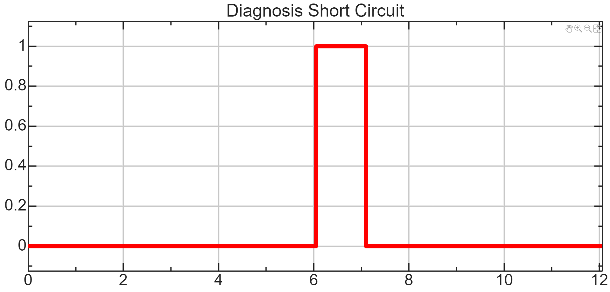

> 📌 **Phase-to-Phase Voltage (V_ab) During Fault Injections:**
> 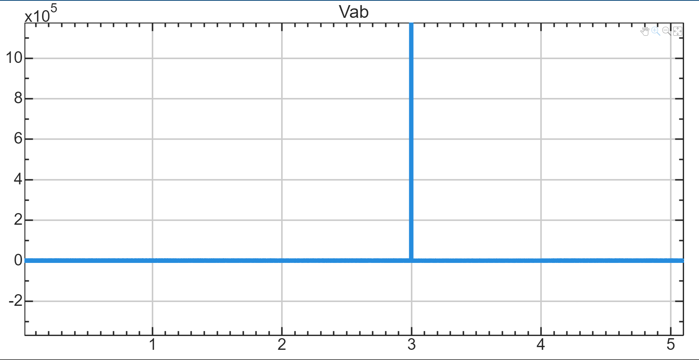

> 📌 **Motor Performance Under OC and SC Fault Conditions:**
> 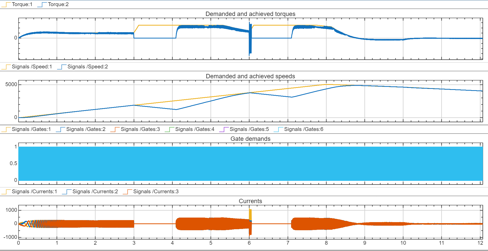

> 📌 **Vehicle Speed Reflecting Momentum Loss During Inverter Fault Periods:**
> 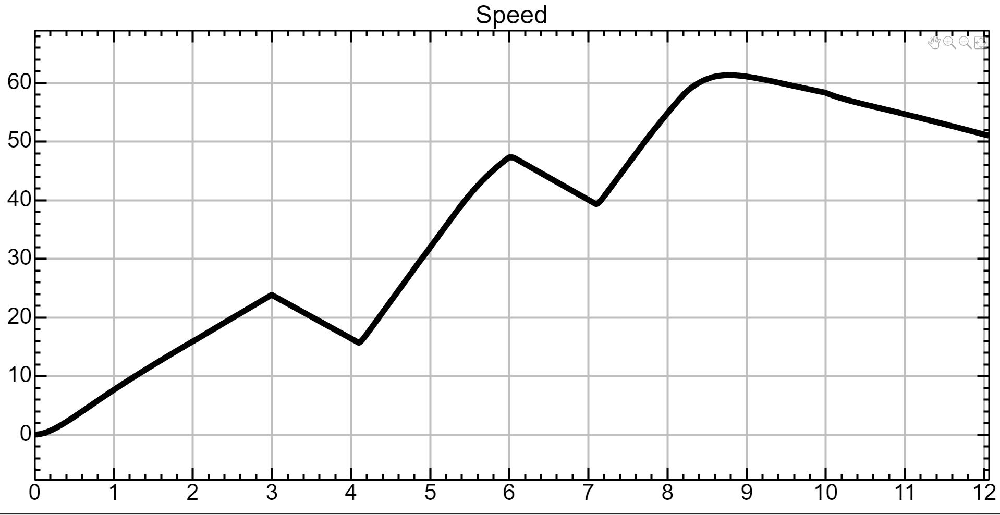

---

### Motor Thermal Fault Detection Results

- Thermal anomaly injected into **Stator A** at **t = 1 s** → temperature spiked from 298 K to 309 K
- Derivative exceeded 10 K/s threshold → thermal fault protocol **instantly activated**
- Flag remained latched until Stator A cooled below **305 K** (at ~t = 3.8 s) → **auto-cleared**
- Supervisor derated motor to **zero torque** during lockout → temporary loss of vehicle speed

> 📌 **Thermal Trigger and Stator A Temperature Response:**
> 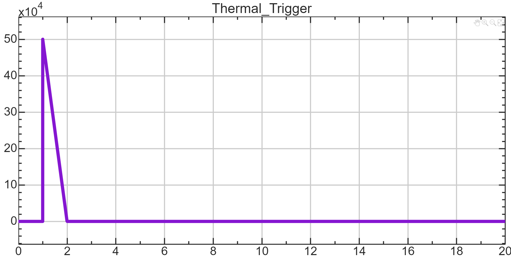

> 📌 **Thermal Fault Flag Latching and Auto-Reset at 305 K:**
> 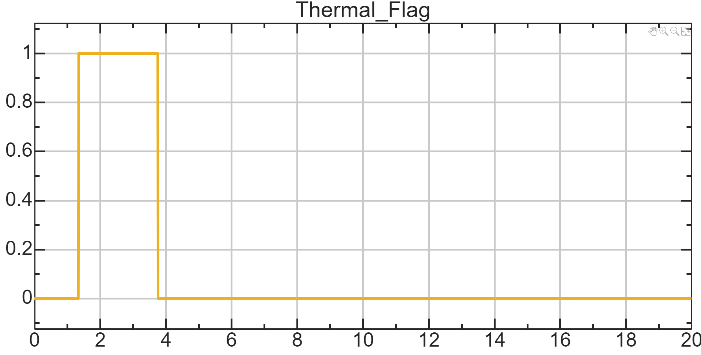

> 📌 **Motor Performance During Thermal Fault (Interrupted Torque Delivery):**
> 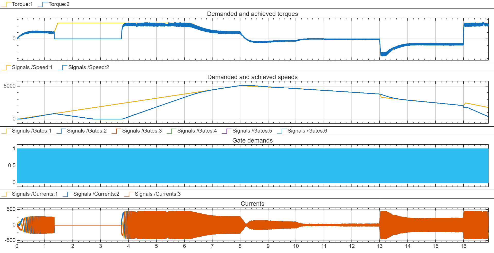

> 📌 **Vehicle Speed Profile During Thermal Lockout Phase:**
> 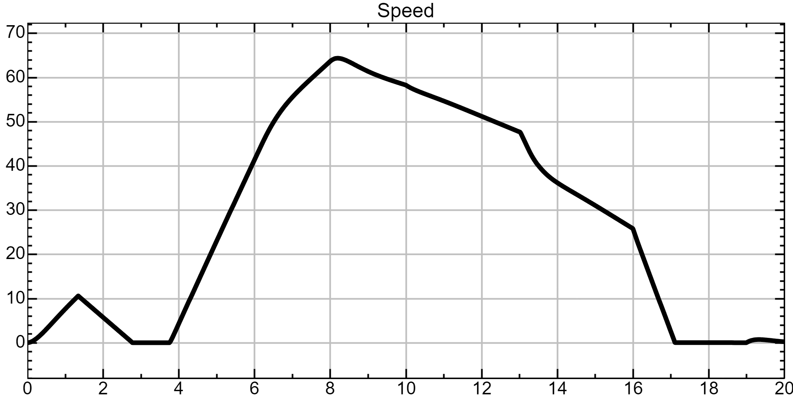

---

### Brake Failure Detection Results

- Hydraulic brake failure induced at **t = 17 s** (hard braking phase)
- Detection module recognized **physics mismatch**: high pressure command + driving speed, but collapsed physical torque
- `brake_failure` flag latched → **Emergency_regen** mode triggered
- Vehicle decelerated sharply using motor only (maximum negative electrical torque)
- Once speed dropped below **0.5 km/h**: `clutch_engage` severed → driveline physically isolated

> 📌 **Brake Failure Flag and Loss of Mechanical Braking Torque:**
> 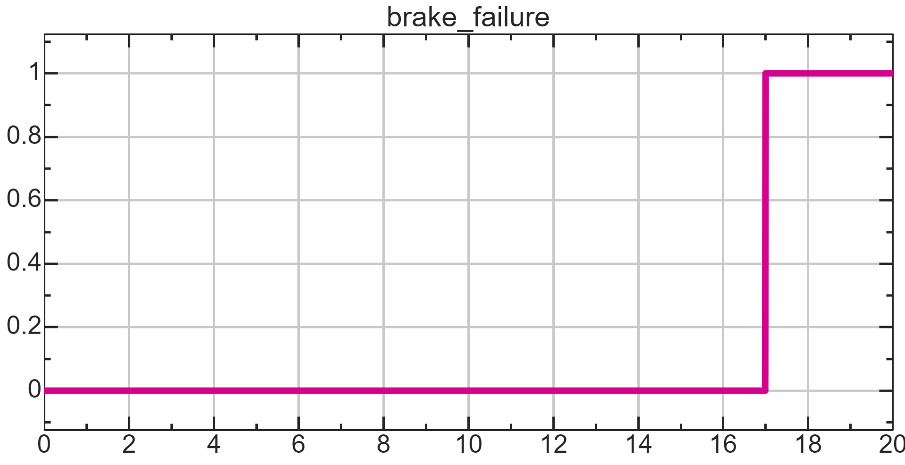

> 📌 **Motor Performance During Brake Failure — Emergency Regenerative Braking:**
> 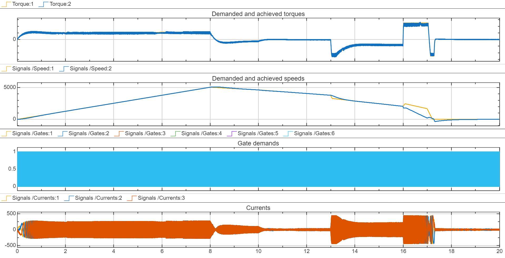

> 📌 **Vehicle Deceleration and Final Clutch Isolation:**
> 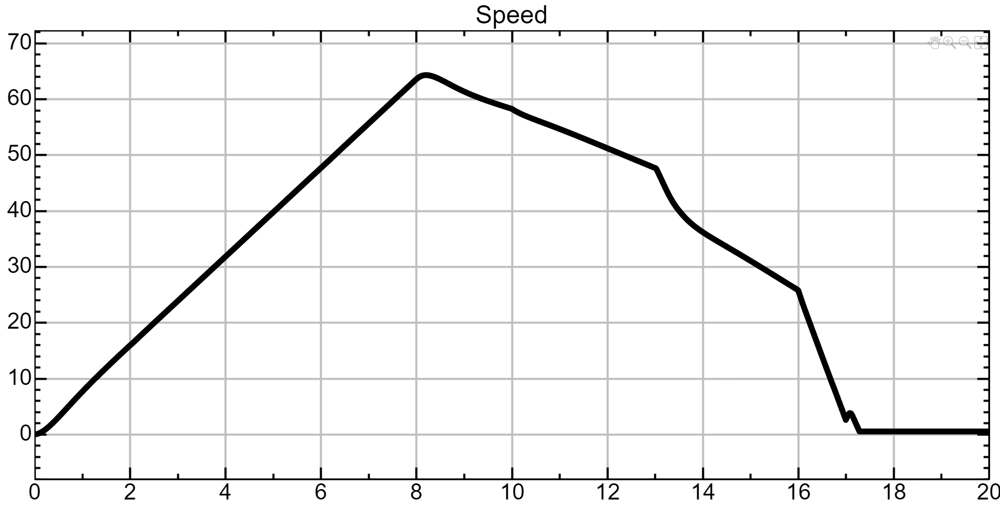

---

### Velocity Sensor Fault Results

- Raw encoder RPM heavily corrupted by **injected high-frequency rotational noise**
- EMA filter (α = 0.02) successfully smoothed the signal **without prohibitive phase lag**
- 50-sample windowed average noise floor **frequently exceeded 10 RPM threshold**
- FDI algorithm correctly and intermittently output **Fault Code 4 (High Noise Floor)**

> 📌 **Raw Velocity Sensor Output Corrupted by Rotational Noise:**
> 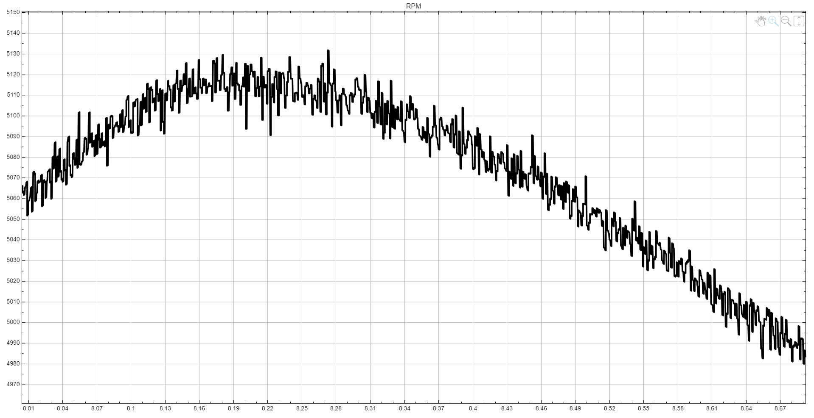

> 📌 **Velocity Signal After EMA Filtering — Significant Noise Attenuation:**
> 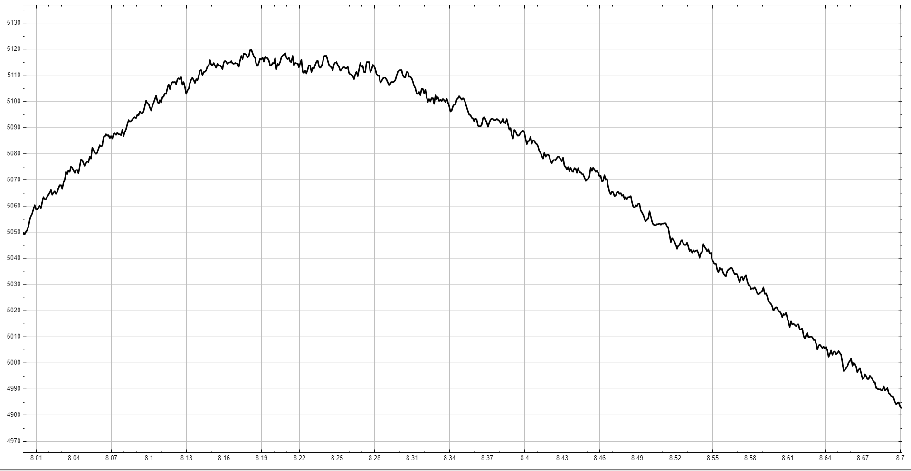

> 📌 **Diagnostic Fault Code Output Responding to Velocity Sensor Noise:**
> 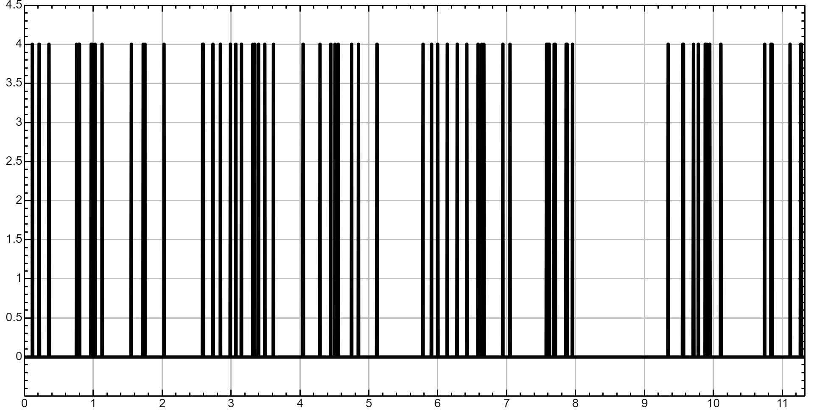

---

### Overall System Validation

- Integrated model completed the full **20-second drive cycle without solver errors**
- Stateflow supervisor **reliably transitioned between all driving and fault states**
- Battery SOC decreased monotonically to approximately **92%**, consistent with realistic EV power draw
- All four FDI modules triggered correctly at intended fault injection times **without cross-triggering**

---

## ⚙️ Solver Configuration

| Parameter | Value |
|---|---|
| Solver | `ode23t` (Trapezoidal Rule) |
| Type | Variable-step |
| Max Step Size | 1 × 10⁻⁵ s |
| Simulation Duration | 20 seconds |
| Switching Period (T_s) | 5 μs |

**Why ode23t?**
- Handles **extreme multi-domain stiffness** spanning:
  - Very fast high-voltage power electronics (T_s = 5 μs)
  - Moderately fast IPMSM electromagnetic dynamics
  - Relatively slow mechanical and thermal behaviors
- Preserves **energy states of LC components** without introducing artificial numerical damping (unlike ode15s)

---

## 📡 Signal Flow Summary

| Signal | Source | Destination / Purpose |
|---|---|---|
| `throttle_cmd` | Driver input | Scaled to speed reference (max 159.75 km/h) |
| `brake_demand` | Driver input | Brake control subsystem; fault detector |
| `speed_cmd_kmh` | Brake/Speed supervisor | Powertrain speed reference |
| `pressure_cmd` | Brake/Speed supervisor | Chassis disc brake actuator |
| `Soc` | Battery model | Stateflow regen threshold; FDI |
| `Thermal_fault` | Motor thermal FDI | Stateflow mode limiter; inverter FDI lockout |
| `Inverter_fault` | SVPWM FDI | Stateflow trip; supervisor |
| `Brake_failure` | Brake FDI | Clutch disengage command |
| `clutch_engage` | Brake FDI | Chassis clutch block |
| `Vab` | Inverter phase voltage | SVPWM fault detector input |
| `i_abc` | Motor phase currents | FOC controller feedback |
| `rpm` | Encoder | FOC speed feedback; velocity FDI |

---

## 🛠️ Tools & Technologies

| Tool | Purpose |
|---|---|
| **MATLAB R2025b** | Scripting, LUT pre-computation, MATLAB function blocks |
| **Simulink 25.2** | Block diagram modelling, simulation |
| **Simscape Electrical** | Physics-based IPMSM, inverter, disc brake modelling |
| **Stateflow** | Supervisory FSM with 6 operational states |
| **Simulink Coder** | ANSI-C code generation (ert.tlc, C99/ISO) |
| **Model Advisor** | MAAB/DO-178/ISO 26262 guideline compliance checks |
| **Simulink Coverage** | Decision and execution coverage analysis |

---

## ✅ Model Validation

### Model Advisor Report

> 📌 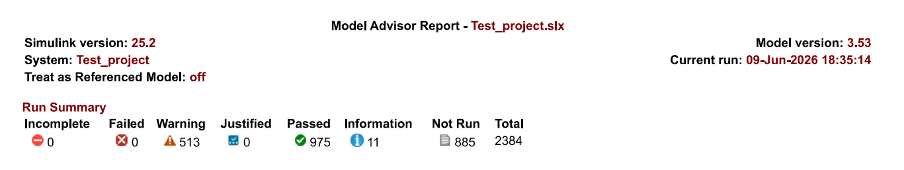

| Metric | Result |
|---|---|
| Simulink Version | 25.2 |
| Model Version | 3.53 |
| Failed Checks | **0** |
| Warning Checks | 513 (all justified) |
| Passed Checks | **975** |
| Total Checks | 2384 |

### Coverage Report

> 📌 **Before optimization:**
> 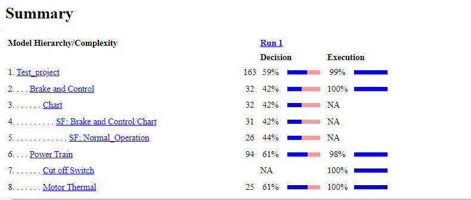

> 📌 **After optimization:**
> 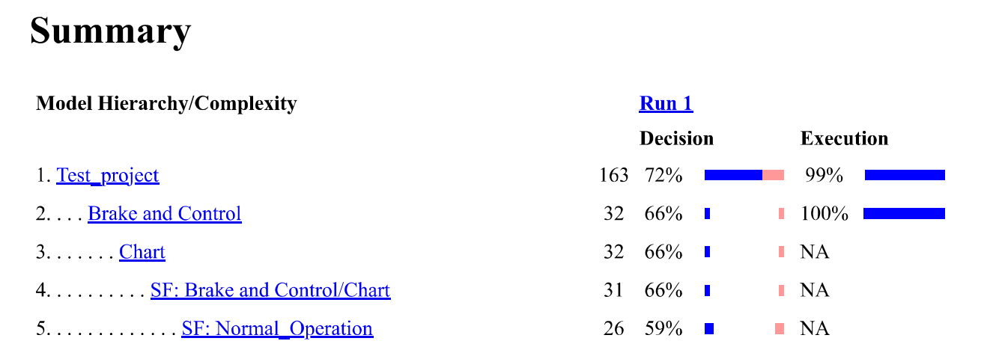

| Subsystem | Decision Coverage (After) | Execution Coverage |
|---|---|---|
| Test_project (Top) | 72% | 99% |
| Brake and Control | 66% | 100% |
| Power Train | — | 98% |
| Motor Thermal | — | 100% |

---

## 💻 Code Generation

> 📌 **Simulink Coder — Configuration Settings:**
> 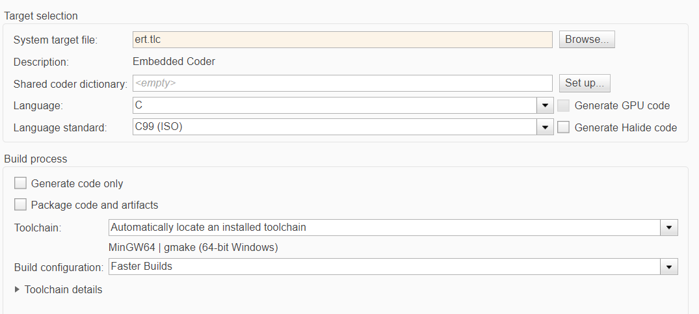

> 📌 **Code Generation Report Summary:**
> 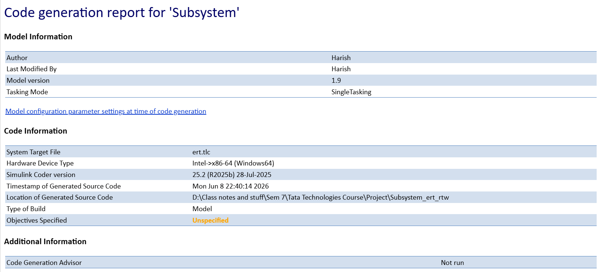

| Parameter | Value |
|---|---|
| System Target File | `ert.tlc` (Embedded Coder) |
| Language | C (C99/ISO) |
| Hardware Device | Intel x86-64 (Windows 64) |
| Simulink Coder Version | 25.2 (R2025b) 28-Jul-2025 |
| Tasking Mode | SingleTasking |
| Build Configuration | Faster Builds |
| Toolchain | MinGW64 / gmake (64-bit Windows) |

**Why ANSI-C Code Generation?**
- The same **verified model logic** can be automatically deployed to embedded microcontroller targets
- Reduces development cycle time and eliminates human transcription errors
- Consistent with **ISO 26262** model-based development workflows

---

## 📁 Repository Structure

```
EV-FDI-Powertrain-Chassis/
│
├── 📄 README.md
├── 📄 LICENSE
│
├── 📂 model/
│   ├── Test_project.slx          # Main Simulink model
│   ├── Test_project_params.m     # Parameter initialization script
│   └── MTPA_LUT.mat              # Pre-computed MTPA look-up tables
│
└── 📂 Images/
    └── (all images referenced in this README)
```

> **Note:** To run the simulation, open `Test_project.slx` in MATLAB R2025b (Simulink 25.2) and run `Test_project_params.m` first to initialize all workspace variables.

---

## 👤 Author

<table>
  <tr>
    <td align="center">
      <strong>Harish R</strong><br/>
      <sub>B.Tech — Electrical and Electronics Engineering</sub><br/>
      <sub>Amrita School of Engineering, Coimbatore</sub><br/>
      <sub>Amrita Vishwa Vidyapeetham</sub><br/>
      <sub>Register No: CB.EN.U4EEE23112</sub><br/><br/>
      <a href="https://www.linkedin.com/in/harish-r-work/">
        
      </a>
      &nbsp;
      <a href="https://github.com/Hackyharish">
        
      </a>
    </td>
  </tr>
</table>

**Supervisor:** SR Mohanrajan
**Programme:** Tata Technologies Applied Model-Based Design (AMBD) Capstone
**Date:** June 11, 2026

---

## 📜 License

This project is licensed under the **MIT License** — see the [LICENSE](LICENSE) file for details.

---

## 🏷️ Keywords

`MATLAB` `Simulink` `Simscape` `Stateflow` `Model-Based Design` `Electric Vehicle` `EV Powertrain` `Fault Detection` `FDI` `IPMSM` `FOC` `MTPA` `SVPWM` `Inverter` `Regenerative Braking` `ISO 26262` `Embedded Coder` `Simulink Coder` `Tata Technologies` `AMBD`

---

<div align="center">
  <sub>Built with ❤️ as part of the Tata Technologies AMBD Capstone Programme | 2026</sub>
</div>
